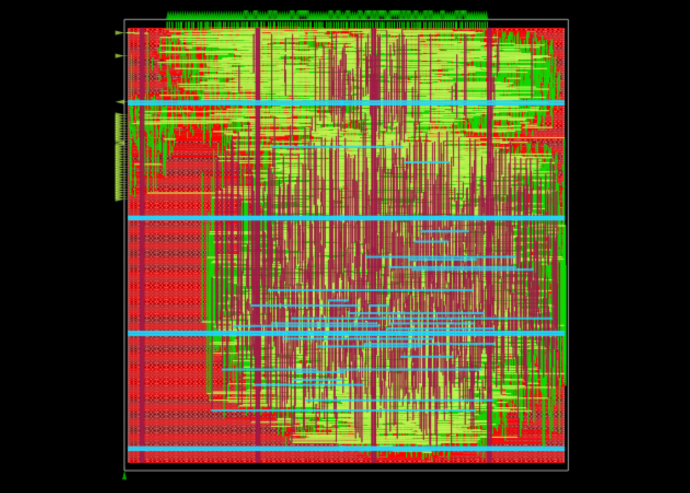
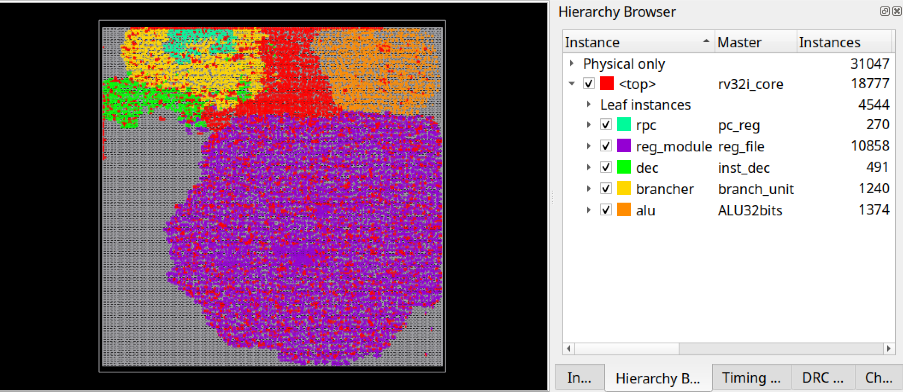

# ASIC Implementation – RV32I Core (Physical Design)

This repository documents the **ASIC physical implementation** of a **RV32I core-only design** using an open-source RTL-to-GDSII flow. The focus of this project is to explore **timing, slew, capacitance, area, and power trade-offs** through both **RTL-level** and **physical-design-level** optimizations.

## Notes

This directory focuses on **physical-design-driven** learning using a functionally complete RV32I core that has been validated on an FPGA prototype. The primary objective is PD trade-off exploration rather than aggressive microarchitectural performance-per-area optimization.


## Toolchain (Open-source)

* **LibreLane** (RTL-to-GDSII flow)
* **Yosys** (Synthesis)
* **OpenROAD** (Floorplanning, Placement, CTS, Routing)
* **SKY130 PDK** (Process Design Kit)


## Baseline Implementation (RTL version 2)

**Configuration**

* LibreLane default configuration
* `CLK_PERIOD = 30 ns`

**Status**

* Full synthesis, placement, CTS, and routing completed
* Passed **DRC** and **LVS**
* No setup or hold violations across **TT / SS / FF** corners

### Area

* **192,824 µm²**

### Timing

* Clock period: **30 ns**
* Operating frequency: **33 MHz**
* Worst Negative Slack (WNS):

  * Setup: **0.713 ns**
  * Hold: **0.104 ns**
* Max Capacitance Violation: **2**
* Max Slew Violation: **165**

### Power

* **4.0 mW** (core-only, estimated)

### Design Statistics

* Wires: **7,383**
* Ports: **12**
* Cells: **7,473**


## Improvement 1 : RTL version 2 and Timing and Slew Optimization

### Goal

Improve **setup timing margin** and reduce **slew violations** while maintaining DRC/LVS clean results.

### Method

**Physical Design Configuration Tuning**

```tcl
SYNTH_HIERARCHY_MODE = keep
MAX_FANOUT_CONSTRAINT = 6
SYNTHESIS_STRATEGY = AREA 3
```

### Results

* No setup or hold violations
* Passed **DRC** and **LVS**
* Significant improvement in **setup WNS**
* Large reduction in **slew violations**
* Area and hold slack trade-off

### Area

* **289,700 µm²**

### Timing

* Clock period: **30 ns**
* Operating frequency: **33 MHz**
* Worst Negative Slack (WNS):

  * Setup: **10.8 ns**
  * Hold: **0.0155 ns**
* Max Capacitance Violation: **1**
* Max Slew Violation: **22**

### Power

* **4.44 mW** (core-only, estimated)

### Design Statistics

* Wires: **12,978**
* Ports: **90**
* Cells: **14,561**


## Improvement 2 - RTL Version 3 and Frequency Scaling and Capacitance Cleanup

### Goal

* Increase **operating frequency**
* Fully eliminate **capacitance violations**
* Maintain acceptable power and slew levels

### Method

#### RTL-Level Changes 
	RTL version 3 (More Complex RTL -> Need more area, padding, Util)

#### Physical Design Configuration 

```tcl
SYNTH_HIERARCHY_MODE = keep
MAX_FANOUT_CONSTRAINT = 6
SYNTHESIS_STRATEGY = AREA 3
FP_CORE_UTIL = 40
CELL_PAD = 3
PL_TARGET_DENSITY = 0.55
```

### Results

* Higher achievable frequency
* **Zero capacitance violations**
* Expected trade-off in area, slew, and power

### Area

* **353,021 µm²**

### Timing

* Clock period: **25 ns**
* Operating frequency: **40 MHz**
* Worst Negative Slack (WNS):

  * Setup: **4.88 ns**
  * Hold: **0.0339 ns**
* Max Capacitance Violation: **0**
* Max Slew Violation: **76**

### Power

* **5.96 mW** (core-only, estimated)

### Design Statistics

* Wires: **15,467**
* Ports: **93**
* Cells: **15,476**


### Design Layout View
- Post-placement and routing views captured from the OpenROAD GUI.
#### Full View


#### Hierarchy View


### Throughput Calculation for ASIC 

#### Assumptions
- Base CPI (ideal pipeline): 0.65  
- 20% of instructions incur a 2-cycle stall  
- 15% of instructions incur a 3-cycle stall (load-use hazard)  
- Clock frequency: 40 MHz  

```
CPI = 0.65 + (0.20 × 2) + (0.15 × 3)
    = 0.65 + 0.40 + 0.45
    = 1.50

MIPS = Clock Frequency / CPI
     = 40 MHz / 1.50
     ≈ 26.67 MIPS
```


## Summary of Trade-offs

| Version       | Freq (MHz) | Area (µm²) | Power (mW) | Max Slew | Max Cap |
| ------------- | ---------- | ---------- | ---------- | -------- | ------- |
| Baseline      | 33         | 192,824    | 4.00       | 165      | 2       |
| Improvement 1 | 33         | 289,700    | 4.44       | 22       | 1       |
| Improvement 2 | 40         | 353,021    | 5.96       | 76       | 0       |


## Next Steps

* CTS and buffer optimization for further slew reduction
* Explore **timing-driven placement** strategies
* SRAM-based register file integration
* Antenna and routing congestion optimization
