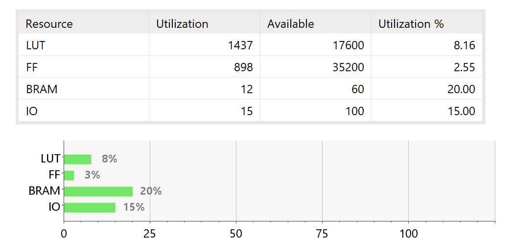
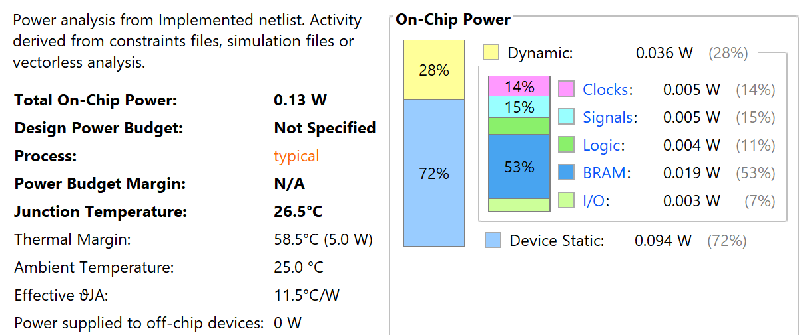
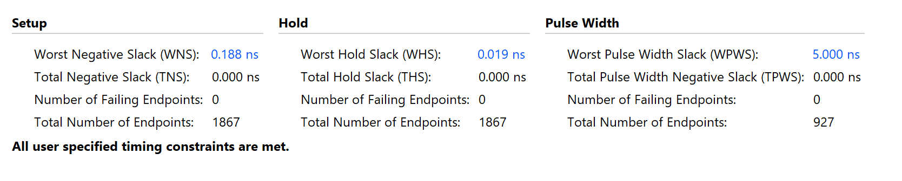

# FPGA Implementation

### Version 1 — 3-Stage Pipeline

**Pipeline:** IF → ID/EXE/MEM → WB  
**Target Board:** AX7010 (Zynq-7000 series)

#### Resource Utilization
- LUTs: 2948
- FFs: 3292
- BRAMs: 11.5  
- Includes Chipscope

#### Power
- 0.125 W

#### Timing
- Operating frequency: **50 MHz**
- WNS:
  - Setup: 0.425 ns
  - Hold: 0.011 ns
  - Pulse width: 8.75 ns

#### Functionality
- Assembly programs compiled to binary
- Program upload via UART (verified using echo pin)
- Correct UART transmission via software
- GPIO output verified using LED display

---

### Version 2 — 5-Stage Pipeline

**Target Board:** AX7010 (Zynq-7000 series)     
**Synthesis Config:** Keep Hierarchy

#### Method
- Add more stage : IF->ID->EXE->MEM->WB
- Use 2-cycle latency RAM (Reduce critical path)
- Change peripheral's reg read to 2-cycle latency

#### Resource Utilization
- LUTs: 1799
- FFs: 1536
- BRAMs: 10
- No Chipscope

#### Power
- 0.114 W

#### Timing
- Operating frequency: **50 MHz**
- WNS:
  - Setup: 2.103 ns
  - Hold: 0.075 ns
  - Pulse width: 9.5 ns

#### Improvements over Version 1
- Improved timing margin
- Reduced resource utilization
- Equivalent functionality

#### Critical Path
- Peripheral DataOut -> Hazard Bypassing -> Comparison(ALU) -> jmp_en -> PC Adder (Branch Unit) -> PC_next

---


### Version 3 — Max Frequency Optimization (Current)

**Target Board:** AX7010 (Zynq-7000 series)
**Synthesis Config** Keep Hierarchy

#### Optimization
- Change Branch Execution into 2 cycle
- Move Branch Condition Lt/Gt in Top module (Near ALU)
- Change Stall Mechanism for memLd : Stall until data load into reg (no bypass) -> Stall 2 cycle
	- Fixing : Delete *Peripheral DataOut -> Hazard Bypassing* from the path then *Rd Reg -> Comparison(ALU) -> jmp_en* -> (reg) -> *PC Adder (Branch Unit) -> PC_next*
- Some Logic adjustment (more mux style for tools to cut critical path) and move some logic 
- Current Critical Path : Reg Rd->ALU (SUB for comparison)->Condition summary logic->jmp_en signal 


#### Resource Utilization
- LUTs: 1882
- FFs: 1676
- BRAMs: 10
- No Chipscope

#### Power
- 0.124 W

#### Timing
- Operating frequency: **66.67 MHz**
- WNS:
  - Setup: 0.354 ns
  - Hold: 0.034 ns
  - Pulse width: 7.0 ns


#### Throughput

- Assumptions
	- Normal Instruction (1 cycle): 0.65  
	- 20% of instructions incur a branching (2-cycle execution)
	- 15% of instructions incur a 3-cycle stall (load-use hazard)  
	- Clock frequency: 66.67 MHz  

```
CPI = 0.65 + (0.20 × 2) + (0.15 × 3)
    = 0.65 + 0.40 + 0.45
    = 1.50

MIPS = Clock Frequency / CPI
     = 66.67 MHz / 1.50
     ≈ 44.44 MIPS
```

#### Improvements over Version 1
- Improved timing margin
- Reduced resource utilization
- Equivalent functionality

---

### Version 4 — Resource & Frequency Optimization (Current)

**Target Board:** AX7010 (Zynq-7000 series)
**Synthesis Config** Keep Hierarchy

#### Optimization
- Use BRAM-based register files : Addr Latech @ Negedge and Data Read Out @ Posedge
- Move Register Read to ID Stage
- Insert register after branch condition calculation
- Use Instruction Flush if branch condition is true

#### Resource Utilization
- LUTs: 1437
- FFs: **898**
- BRAMs: 12
- No Chipscope
- Vivado Implementation Utilization Report


#### Power
- 0.130 W
- Vivado Implementation Power Report


#### Timing
- Operating frequency: **76.9 MHz** (13ns)
- WNS:
  - Setup: 0.188 ns
  - Hold: 0.019 ns
  - Pulse width: 5.0 ns

- Vivado Implementation Timing Report


#### Improvements over Version 1
- Improved Max Frequency
- Higher Throughput
- Reduced resource utilization
- Slightly higher power thourgh higher frequency and BRAM
- Equivalent functionality

#### Throughput

- Assumptions
	- Normal Instruction (1 cycle): 0.65  
	- 10% of instructions incur a branching condition not matched
	- 10% of instructions incur a branching condition matched (3 cycle penalty)
	- 5% of instructions incur a 1-cycle stall (load-use hazard @ MEM)
	- 5% of instructions incur a 2-cycle stall (load-use hazard @ EXE)  
	- Clock frequency: 76.9 MHz  

```
CPI = 0.65 + (0.1 × 1) + (0.1 × 4) + (0.05 × 2) + (0.05 × 3)
    = 1.5

Throughput = Clock Frequency / CPI
     = 76.9 MHz / 1.50
     ≈ 51.3 MIPS
```

---
## Final Comparison Summary

| Metric | Version 1 | Version 2 | Version 3 | Version 4 |
|------|-----------|-----------|-----------|-----------|
| Pipeline | 3-stage | 5-stage | 5-stage | 5-stage |
| Register File | FF-based | FF-based | FF-based | **BRAM-based** |
| Fmax (MHz) | 50.0 | 50.0 | 66.67 | **76.9** |
| Have stall mechanism| No | No | Yes | Yes
| Avg CPI | ~1.0 | ~1.0 | 1.50 | 1.50 |
| Throughput (MIPS) | 50.0 | 50.0 | 44.4 | **51.3** |
| LUTs | 2948 | 1799 | 1882 | **1437** |
| FFs | 3292 | 1536 | 1676 | **898** |
| BRAMs | 11.5 | 10 | 10 | 12 |
| Power (W) | 0.125 | 0.114 | 0.124 | 0.130 |
